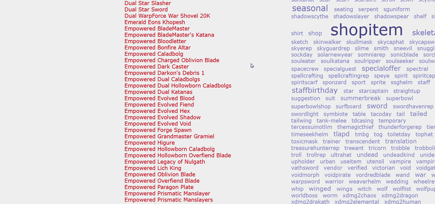

# AQW Wiki Gaze

Userscripts for the [AQW Wiki](https://aqwwiki.wikidot.com). They add things the wiki does not do on its own, like seeing a page's details without opening it.

## Scripts

| Script | What it does | Install |
| --- | --- | --- |
| [AQW Wiki Gaze](#aqw-wiki-gaze-1) | Shows a page's image, rarity, damage and bonuses when you hover a link | [Greasy Fork](https://greasyfork.org/en/scripts/597891-aqw-wiki-gaze) · [Raw](https://raw.githubusercontent.com/soyquetzal/aqw-wiki-gaze/main/aqw-wiki-gaze.user.js) |
| [AQW Wiki Copy Join](#aqw-wiki-copy-join) | Adds a Copy button to the `/join` commands on map pages | [Greasy Fork](https://greasyfork.org/en/scripts/597901-aqw-wiki-copy-join) · [Raw](https://raw.githubusercontent.com/soyquetzal/aqw-wiki-gaze/main/aqw-wiki-copy-join.user.js) |

Each script works on its own. Install only the ones you want.

## Install

1. Install a userscript manager such as [Violentmonkey](https://violentmonkey.github.io/) or Tampermonkey.
2. Open the link for the script you want in the table above and confirm the install.

Your userscript manager will update the scripts when a new version is released.

---

## AQW Wiki Gaze

When you hover a link on the wiki, a small window shows what is on that page. You can check an item or a monster without opening it, reading it and going back.

### What you see

- The page name and up to two images.
- Availability tags: AC, Rare, Pseudo-Rare, Seasonal, Special Offer, Legend and NO IoDA.
- The damage range and its class: Default, Fixed, High, Medium or Other.
- Boosts with their percentage: Gold, XP, Class Points and Reputation, plus damage bonuses against Chaos, Dragon, Drakath, Elemental, Human, Orc, Undead or all monsters.
- The monster's kind — Chaos, Dragon, Drakath, Elemental or Undead — on monster pages, so you know which racial weapons hit harder.

### Where it works

On any link you find while browsing the wiki: items in shops, merge shops and other pages, and monster pages. Links that are not wiki pages (files, forums, site tools) are ignored. Pages that are not items or monsters, such as worlds or quests, show less information and no image.

### Good to know

- The preview appears after you hold the cursor on a link for a moment. Moving across a page does not load anything.
- A page you have already previewed shows right away the next time you hover it.
- It only reads public wiki pages. It does not use your account and does not send anything anywhere else.
- It spaces out its requests and pauses if the wiki is having trouble, so it does not add load to the site.

### Limitations

- Damage ranges and boosts are read from each page's text. On pages worded differently, a tag may show without its number, or not show at all.
- It works with a mouse. There is no touch support.

---

## AQW Wiki Copy Join

On map pages, teleport commands like `/join tercessuinotlim`` get a **Copy** button next to them. One click puts the command in your clipboard, so you don't have to select it by hand or memorize it.

The button shows "Copied!" when it works, and "Error" if your browser blocks access to the clipboard.

### Limitations

- It only detects commands written on their own line in a list. A command inside a sentence or a link is left as it is.

---

## Issues

If a page does not show what it should, please report it in the [issues](https://github.com/soyquetzal/aqw-wiki-gaze/issues) with the page link and what you expected to see.

## License

MIT
